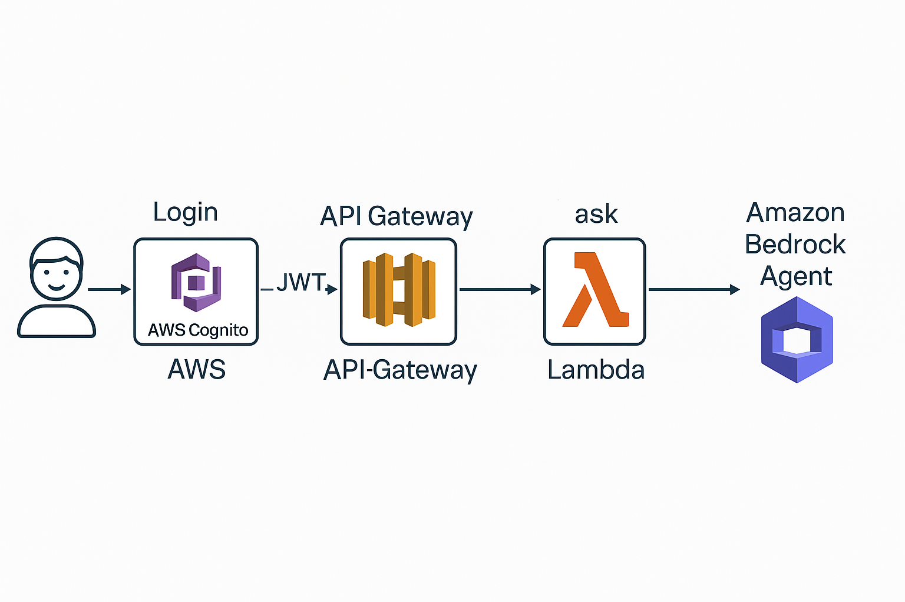

# OWASP Top 10 Secure Coding Assistant (SC AI)

This project is an AI-powered assistant that helps students and developers understand the OWASP Top 10 web vulnerabilities. It uses **Amazon Bedrock Agents**, **Cognito for authentication**, **API Gateway**, and **Streamlit** as the frontend.

---

## 🧠 Features

- ✅ Login with Amazon Cognito
- 🔐 Secure JWT-protected API calls
- 🤖 Queries handled by an Amazon Bedrock Agent
- 💬 Streamlit-based UI for interactive Q&A
- 📄 Deployable via AWS CloudFormation

---

## 🖼️ Architecture



---

## 📁 Folder Structure

```
sc-ai-owasp-agent/
├── .streamlit/
│   └── secrets.toml              # Local secrets file (ignored in .gitignore)
├── app.py                        # Streamlit frontend app
├── owasp-agent-backend.yaml      # CloudFormation backend stack (Cognito + API + Lambda)
├── A_flowchart_diagram_visualizes_an_AWS_architecture.png
├── .gitignore
└── README.md
```

---

## 🚀 Deployment Steps

### 1. Deploy AWS Backend

You must have an existing **Amazon Bedrock Agent ID**.

```bash
aws cloudformation deploy   --template-file owasp-agent-backend.yaml   --stack-name owasp-agent-backend   --capabilities CAPABILITY_NAMED_IAM   --parameter-overrides BedrockAgentId=your-bedrock-agent-id
```

> After deployment, note the CloudFormation **Outputs**:
> - `UserPoolId`
> - `ClientId`
> - `ApiEndpoint`

---

### 2. Configure Frontend Secrets

Create a file `.streamlit/secrets.toml`:

```toml
API_URL = "https://your-api-id.execute-api.region.amazonaws.com/prod/ask"
CLIENT_ID = "your-cognito-client-id"
COGNITO_DOMAIN = "your-domain.auth.region.amazoncognito.com"
REDIRECT_URI = "http://localhost:8501"
```

---

### 3. Install and Run the App

```bash
pip install streamlit requests
streamlit run app.py
```

---

## 🧪 Example Questions to Ask

- What is broken access control?
- How can injection vulnerabilities be prevented?
- Describe an example of insecure deserialization.

---

## 🛡️ Security Note

All API access is protected via JWT using Amazon Cognito. No unauthenticated calls can access the `/ask` endpoint.

---

## 📌 Future Enhancements

- [ ] Conversation history log
- [ ] OWASP challenge walkthroughs
- [ ] Streamlit Cloud or EC2 deployment option
- [ ] Voice query input

---

## 📜 License

MIT License – For educational use with OWASP content.